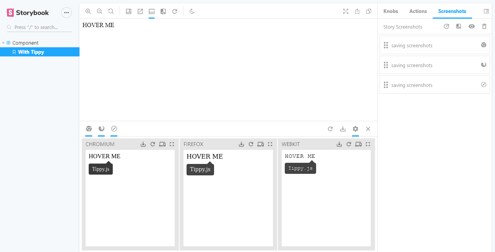

# storybook-addon-playwright

An addon to visually test the stories in the multiple browsers within storybook environment.

> Addon will not work in storybook static build, but the screenshots can be tested against the static build files.

> This package has been tested with react framework only, therefore it may not work with other frameworks.

> Works with [Component Story Format (CSF)](https://storybook.js.org/docs/formats/component-story-format/) only.



## Compatibility

| Package    | Version |
| ---------- | ------- |
| storybook  | ~6.2    |
| playwright | ~1.10   |

## Motivation

Being able to make components that feel and look same in all browser were always a challenge, it's required that developer keep switching between browsers and visually checking the components. It's also important to keep track of the changes and be able to detect changes as quickly as possible. That's why this add-on has been created. With the help of playwright and storybook now it's possible to visually check components and be notified of changes all in one place.

## Example

[storybook-addon-playwright-example](https://github.com/ccpu/storybook-addon-playwright-example)

## Getting Started

Required packages:

- storybook-addon-playwright
- @storybook/addon-knobs

```js
yarn add storybook-addon-playwright @storybook/addon-knobs --dev
```

## Configuration

within `.storybook/main.js`

```js
module.exports = {
  stories: ['../**/*.stories.[tj]sx'],
  addons: [
    '@storybook/addon-knobs/register',
    'storybook-addon-playwright/preset',
    'storybook-addon-playwright/register',
  ],
};
```

within `.storybook/main.js` OR `.storybook/middleware.js`:

```js
const { setConfig } = require('storybook-addon-playwright/configs');
const playwright = require('playwright');

(async () => {
  let browser = {
    chromium: await playwright['chromium'].launch(),
    firefox: await playwright['firefox'].launch(),
    webkit: await playwright['webkit'].launch(),
  };
  setConfig({
    storybookEndpoint: `http://localhost:6006/`,
    getPage: async (browserType, options) => {
      const page = await browser[browserType].newPage(options);
      return page;
    },
    afterScreenshot: async (page) => {
      await page.close();
    },
  });
})();
```

within `.storybook/middleware.js` :

```js
const middleware = require('storybook-addon-playwright/middleware');
module.exports = middleware;
```

## setConfig Options

- storybookEndpoint
- enableMigration
- beforeScreenshot
- afterScreenshot
- beforeStoryImageDiff
- afterStoryImageDiff
- beforeFileImageDiff
- afterFileImageDiff
- beforeAllImageDiff
- afterAllImageDiff
- pageGotoOptions
- afterUrlConstruction
- afterNavigation
- releaseModifierKey

### storybookEndpoint

`storybookEndpoint` must match the ip/port of storybook.

> For docker and none locale browsers, the public ip address of storybook required.

### enableMigration

If set true will apply changes to the json file generate by add-on, read more in `Migration` section.

### beforeScreenshot

Will be called before taking a screenshot, useful to manipulate the page.

### afterScreenshot

Will be called after a screenshot taken.

### afterStoryImageDiff

Will be called before/after running image diff test on whole application screenshot.

### beforeStoryImageDiff/afterStoryImageDiff

Will be called before/after running image diff on particular story.

### beforeFileImageDiff/afterFileImageDiff

Will be called before/after running image diff on particular file.

### beforeAllImageDiff/afterAllImageDiff

Will be called after imageDiff process of all stories screenshots complete.

### pageGotoOptions

please refer top [Playwright API page.goto option](https://github.com/microsoft/playwright/blob/master/docs/api.md#pagegotourl-options)

### afterUrlConstruction

Will be called before page.goto, can be used to manipulate url.

### afterNavigation

Will be called when page navigated to story.

### releaseModifierKey

When set to true, will execute keyboard.up for modifier key, Shift, Meta, Control, or Alt, after screenshot taken.

## How it works

This add-on is basically an interface between playwright and storybook stories.
Add-on executes user instruction on the page provided in configuration.

Instructions created by user will save in a json file next to the story file. therefore its available for the next load.

This add-on consist of there parts:

- Action list panel
- Screenshots list panel
- Screenshots preview panel

### Action list panel:

Action panel act like a playground, it consists of the list of action sets that created by user for specific story and will be executed in the browser page when selected.

An action set can have single or multiple actions.

Actions are referred to the playwright page methods such as click, mouse move etc...

### Screenshots list panel

This panel holds the screenshots taken previously by user, here you can manage screenshots such as delete edit or sort screenshots.

### Screenshots preview panel

The preview panel displays the latest screenshots taken by the playwright, it can selectively display all or some of the supported browser by playwright.

Here you can save and change the screenshots settings such as with, height etc.

The screenshots are saved in the folder named `__screenshots__` under the story folder.

## Add or extend playwright page methods

To add or extend the playwright method, the following properties are available in the `setConfig` method:

- customActionSchema

### customActionSchema

This property enables developer to add a new method to the playwright page. every entries in the `customActionSchema` property will appear in the 'Add Actions' menu under the `Actions` panel.

> This property follows the [json-schema]('http://json-schema.org/') rules with one additional property named `parameters`, therefore clear understanding of `json-schema` required.

Here is an example to add a box to the page:

```js
//async function addBox(this: Page, position: { x: number; y: number })
async function addBox(position) {
  await this.evaluate((pos) => {
    if (!pos) return;
    const div = document.createElement('div');
    div.style.backgroundColor = '#009EEA';
    div.style.width = '200px';
    div.style.height = '200px';
    div.style.position = 'absolute';
    div.style.top = pos.y + 'px';
    div.style.left = pos.x + 'px';
    document.body.append(div);
  }, position);
}

(async () => {
  let browser = {
    chromium: await playwright['chromium'].launch(),
    firefox: await playwright['firefox'].launch(),
    webkit: await playwright['webkit'].launch(),
  };
  setConfig({
    storybookEndpoint: `http://localhost:6006/`,
    getPage: async (browserType, options) => {
      const page = await browser[browserType].newPage(options);
      page.addBox = addBox;
      return page;
    },
    afterScreenshot: async (page) => {
      await page.close();
    },
    customActionSchema: {
      addBox: {
        type: 'promise',
        parameters: {
          position: {
            type: 'object',
            properties: {
              x: {
                type: 'number',
              },
              y: {
                type: 'number',
              },
            },
            required: ['x', 'y'],
          },
        },
      },
    },
  });
})();
```

## Additional Page Methods

The following custom methods has been added to the playwright page:

- clearInput,
- mouseDownOnSelector
- mouseMoveToSelector
- setSelectorSize
- scrollSelector
- dragDropSelector
- takeScreenshot
- takeScreenshotOptions
- selectorMouseWheel
- mouseFromTo

### clearInput

This method fetches an element with `selector`, waits for actionability checks, focuses the element, clear it and triggers an input event.

### mouseDownOnSelector

This method fetches an element with `selector`, and perform mousedown on the center of selector.

### mouseMoveToSelector

This method fetches an element with `selector`, and move the mouse to center of selector.

### setSelectorSize

This method fetches an element with `selector`, and set the selector with or height.

### scrollSelector

This method fetches an element with `selector`, and set the selector scrollLeft and scrollTop.

### dragDropSelector

This method fetches an element with `selector`, and move it to the position given by user.

### takeScreenshot

This method will take a screenshot between actions, its useful for taking a screenshot in sequence for events/actions.
In the end the screenshots will be merged with the final screenshot.

### takeScreenshotOptions

The purpose of this action is to have centralized options for all screenshots.
This action can be used in conjunction with takeScreenshot action only.
Only one instance can be used.

### selectorMouseWheel

This method fetches an element with `selector`, and dispatch WheelEvent.

### mouseFromTo

This method will perform mouse down, move,and up from to selected location.

## Testing

Screenshots saved with the addon can also be tested with the test framework like jest. to do so configure the jest as follow:

add setup file to `jest.config.js`

```js
module.exports = {
  setupFilesAfterEnv: ['./jest.setup.js'],
};
```

within `jest.setup.js`

```js
const playwright = require('playwright');
const { setConfig } = require('storybook-addon-playwright/configs');
const { toMatchScreenshots } = require('storybook-addon-playwright');

expect.extend({ toMatchScreenshots });

let browser = {};

beforeAll(async () => {
  browser = {
    chromium: await playwright['chromium'].launch(),
    firefox: await playwright['firefox'].launch(),
    webkit: await playwright['webkit'].launch(),
  };
  setConfig({
    storybookEndpoint: `http://localhost:6006/`, // or  `./storybook-static`
    getPage: async (browserType, options) => {
      const page = await browser[browserType].newPage(options);
      return page;
    },
    afterScreenshot: async (page) => {
      await page.close();
    },
  });
});

afterAll(async () => {
  const promises = Object.keys(browser).map((browserType) =>
    browser[browserType].close(),
  );
  await Promise.resolve(promises);
});
```

and within the test file:

```js
describe('test screenshots', () => {
  it('should pass image diff', async () => {
    await expect('*').toMatchScreenshots();
  }, 10000);
});
```

Or with `toMatchImageSnapshot`:

```js
const { getScreenshots } = require('storybook-addon-playwright');

describe('test screenshots manually', () => {
  it('should pass image diff', async () => {
    await getScreenshots({
      onScreenshotReady: (screenshotBuffer, baselineScreenshotPath) => {
        expect(screenshotBuffer).toMatchImageSnapshot({
          customSnapshotIdentifier: baselineScreenshotPath.screenshotIdentifier,
          customSnapshotsDir: baselineScreenshotPath.screenshotsDir,
        });
      },
    });
  }, 10000);
});
```

> Make sure to set appropriate timeout for your tests.

## Typescript

If your editor does not recognise the `toMatchScreenshots` matcher, add a global.d.ts file to your project with:

```js
import 'storybook-addon-playwright';
```

## Migration

It is possible that the structure of the json file generated by addon change because of the new features, to fix and apply the changes set the `enableMigration` to `true` in `setConfig` and run the storybook.

> Make sure after migration set the `enableMigration` to `false`
